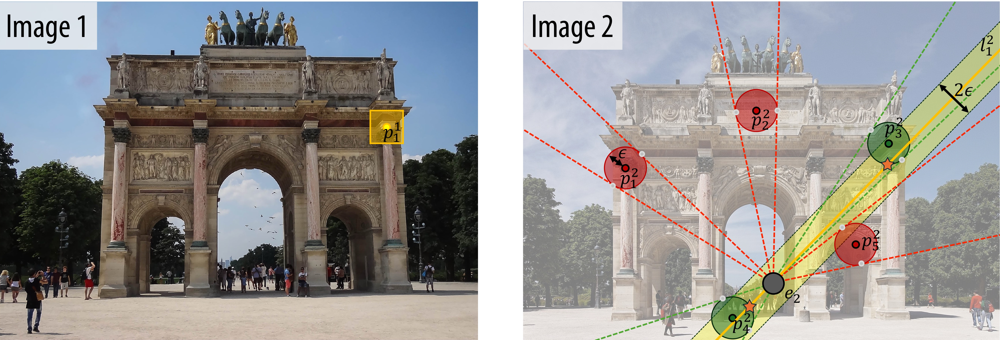
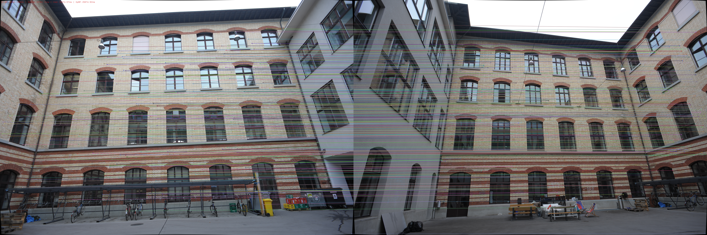

# Pixel-Accurate Epipolar Guided Matching

<p align="center"><strong>3DV 2026</strong></p>

<p align="center">
  <a href="#">📄 Paper (Coming Soon)</a> &nbsp;|&nbsp;
  <a href="https://github.com/LexaNagiBator228/Pixel-Accurate-Epipolar-Guided-Matching">💻 Code</a> &nbsp;|&nbsp;
  <a href="https://lexanagibator228.github.io/Pixel-Accurate-Epipolar-Guided-Matching/">🌐 Project Page</a>
</p>

<p align="center"><em>Official implementation of "Pixel-Accurate Epipolar Guided Matching" — 3DV 2026</em></p>

<p align="center">
  
</p>

---

## News
- **[March 2026]** Code released.
- **[January 2026]** Paper accepted to 3DV 2026!
- **[Coming Soon]** Paper on arXiv.

## Abstract

Keypoint matching can be slow and unreliable in challenging conditions such as repetitive textures or wide-baseline views. In such cases, known geometric relations (e.g., the fundamental matrix) can be used to restrict potential correspondences to a narrow epipolar envelope, thereby reducing the search space and improving robustness. These epipolar-guided matching approaches have proved effective in tasks such as SfM; however, most rely on coarse spatial binning, which introduces approximation errors, requires costly post-processing, and may miss valid correspondences. We address these limitations with an exact formulation that performs candidate selection directly in angular space. In our approach, each keypoint is assigned a tolerance circle which, when viewed from the epipole, defines an angular interval. Matching then becomes a 1D angular interval query, solved efficiently in logarithmic time with a segment tree. This guarantees pixel-level tolerance, supports per-keypoint control, and removes unnecessary descriptor comparisons. Extensive evaluation on ETH3D demonstrates noticeable speedups over existing approaches while recovering exact correspondence sets.

## Method Overview

- **Angular Interval Formulation**: Each keypoint's tolerance disk defines a 1D angular interval as seen from the epipole
- **Segment Tree Data Structure**: Enables O(log N + K) candidate queries vs. O(N) for brute-force methods
- **Exact Geometric Filtering**: Pixel-level precision with no approximation errors
- **Per-Keypoint Control**: Supports individual tolerance settings

<!-- ## Results

<p align="center">
  
</p>

<p align="center">
  
</p> -->

## Installation

### Requirements

**Python** (≥ 3.8):
```
numpy
opencv-python
pybind11
```

**C++ build tools:**
- CMake ≥ 3.14
- C++17 compiler (GCC ≥ 9, Clang ≥ 10, or MSVC 2019+)
- Eigen3
- OpenMP (optional — enables multi-threaded execution)

On Ubuntu/Debian:
```bash
sudo apt install cmake libeigen3-dev libomp-dev
```

On macOS (Homebrew):
```bash
brew install cmake eigen libomp
```

### Build

```bash
git clone https://github.com/LexaNagiBator228/Pixel-Accurate-Epipolar-Guided-Matching.git
cd Pixel-Accurate-Epipolar-Guided-Matching

# Install Python dependencies
pip install numpy opencv-python pybind11

# Build the C++ extension (output goes to epipolar_matching/)
bash build.sh
```

The script configures CMake and builds the project, placing the compiled `.so` module in `epipolar_matching/`.

## Running the Demos

### Synthetic demo — no data needed

```bash
python demo.py
```

Generates two synthetic camera views of 50 k random 3-D points, runs the epipolar filters (Seg Tree, Angular Hash), prints a recall/timing table, and saves `demo_matches.png`.

Expected output (approximate):
```
────────────────────────────────────────────────────────────────────────
Method                           Recall   Avg cands  Time (ms)
────────────────────────────────────────────────────────────────────────
CV BF (no epipolar)            0.964        N/A      183.5
Seg Tree (optimised)           1.000      530.3        5.1
Angular Hash                   1.000      530.3       12.4
────────────────────────────────────────────────────────────────────────
```

### Real-image demo — calibrated fisheye pair

```bash
python demo_real.py
```

Loads a pair of fisheye images from `exc/`, undistorts them using COLMAP camera parameters, extracts 50 k SIFT keypoints per image, and matches them with each filter. Saves results to `demo_real_matches.png`.

Expected output (approximate):
```
────────────────────────────────────────────────────────────────────────
Method                           Matches   Avg cands  Time (ms)
────────────────────────────────────────────────────────────────────────
CV BF (no epipolar)                 4198        N/A     2905.4
Seg Tree (optimised)                4336      284.4       14.1
Angular Hash                        4336      284.4       97.2
────────────────────────────────────────────────────────────────────────
```

Requires the following files in `exc/`:

| File | Description |
|------|-------------|
| `cameras.txt` | COLMAP `THIN_PRISM_FISHEYE` camera model |
| `images_mod.txt` | COLMAP images file (DSC_0320 and DSC_0321 entries) |
| `DSC_0320.JPG` | First image |
| `DSC_0321.JPG` | Second image |

## Citation

If you find this work useful for your research, please consider citing:

```bibtex
@inproceedings{
nasypanyi2026pixelaccurate,
title={Pixel-Accurate Epipolar Guided Matching},
author={Oleksii Nasypanyi and Francois Rameau},
booktitle={Thirteenth International Conference on 3D Vision},
year={2026},
url={https://openreview.net/forum?id=9zRX5HrpnA}
}
```

## Contact

- Oleksii Nasypanyi — [oleksii.nasypanyi@stonybrook.edu](mailto:oleksii.nasypanyi@stonybrook.edu) (Stony Brook University)
- Francois Rameau (SUNY Korea)
